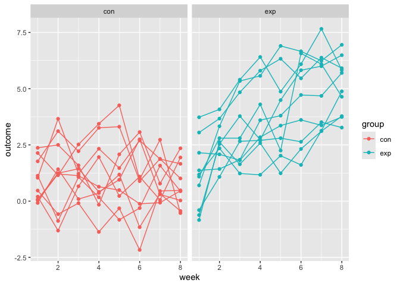

iteration_and_listcols
================
Hanrui Li
2024-10-29

``` r
library(tidyverse)
library(rvest)

set.seed(1)
```

## Lists

You can put anything in a list.

``` r
vec_numeric = 5:8
vec_char = c("My", "name", "is", "Jeff")
vec_logical = c(TRUE, TRUE, TRUE, FALSE)
```

``` r
l = list(
  vec_numeric = 5:8,
  mat = matrix(1:8, nrow = 2, ncol = 4),
  vec_logical = c(TRUE, TRUE, FALSE, TRUE, FALSE, FALSE),
  summary = summary(rnorm(1000)))
```

``` r
l
```

    ## $vec_numeric
    ## [1] 5 6 7 8
    ## 
    ## $mat
    ##      [,1] [,2] [,3] [,4]
    ## [1,]    1    3    5    7
    ## [2,]    2    4    6    8
    ## 
    ## $vec_logical
    ## [1]  TRUE  TRUE FALSE  TRUE FALSE FALSE
    ## 
    ## $summary
    ##     Min.  1st Qu.   Median     Mean  3rd Qu.     Max. 
    ## -3.00805 -0.69737 -0.03532 -0.01165  0.68843  3.81028

``` r
l$vec_numeric
```

    ## [1] 5 6 7 8

``` r
l[[1]]
```

    ## [1] 5 6 7 8

``` r
l[[1]][1:3]
```

    ## [1] 5 6 7

``` r
mean(l[["vec_numeric"]])
```

    ## [1] 6.5

## `for` loops

Create a new list.

``` r
list_norms = 
  list(
    a = rnorm(20, 3, 1),
    b = rnorm(20, 0, 5),
    c = rnorm(20, 10, .2),
    d = rnorm(20, -3, 1)
  )

list_norms
```

    ## $a
    ##  [1] 4.134965 4.111932 2.129222 3.210732 3.069396 1.337351 3.810840 1.087654
    ##  [9] 1.753247 3.998154 2.459127 2.783624 1.378063 1.549036 3.350910 2.825453
    ## [17] 2.408572 1.665973 1.902701 5.036104
    ## 
    ## $b
    ##  [1] -1.63244797  3.87002606  3.92503200  3.81623040  1.47404380 -6.26177962
    ##  [7] -5.04751876  3.75695597 -6.54176756  2.63770049 -2.66769787 -1.99188007
    ## [13] -3.94784725 -1.15070568  4.38592421  2.26866589 -1.16232074  4.35002762
    ## [19]  8.28001867 -0.03184464
    ## 
    ## $c
    ##  [1] 10.094098 10.055644  9.804419  9.814683 10.383954 10.176256 10.148416
    ##  [8] 10.029515 10.097078 10.030371 10.008400 10.044684  9.797907 10.480244
    ## [15] 10.160392  9.949758 10.242578  9.874548 10.342232  9.921125
    ## 
    ## $d
    ##  [1] -5.321491 -1.635881 -1.867771 -3.774316 -4.410375 -4.834528 -3.269014
    ##  [8] -4.833929 -3.814468 -2.836428 -2.144481 -3.819963 -3.123603 -2.745052
    ## [15] -1.281074 -3.958544 -4.604310 -4.845609 -2.444263 -3.060119

``` r
is.list(list_norms)
```

    ## [1] TRUE

``` r
mean_and_sd = function(x) {
  
  if (!is.numeric(x)) {
    stop("Argument x should be numeric")
  } else if (length(x) == 1) {
    stop("Cannot be computed for length 1 vectors")
  }
  
  mean_x = mean(x)
  sd_x = sd(x)

  tibble(
    mean = mean_x, 
    sd = sd_x
  )
}
```

I can apply the function to each list element.

``` r
mean_and_sd(list_norms[[1]])
```

    ## # A tibble: 1 × 2
    ##    mean    sd
    ##   <dbl> <dbl>
    ## 1  2.70  1.12

``` r
mean_and_sd(list_norms[[2]])
```

    ## # A tibble: 1 × 2
    ##    mean    sd
    ##   <dbl> <dbl>
    ## 1 0.416  4.08

``` r
mean_and_sd(list_norms[[3]])
```

    ## # A tibble: 1 × 2
    ##    mean    sd
    ##   <dbl> <dbl>
    ## 1  10.1 0.191

``` r
mean_and_sd(list_norms[[4]])
```

    ## # A tibble: 1 × 2
    ##    mean    sd
    ##   <dbl> <dbl>
    ## 1 -3.43  1.18

Let’s use a `for` loop.

``` r
output = vector("list", length = 4)

for (i in 1:4) {
  output[[i]] = mean_and_sd(list_norms[[i]])
}
```

## `map`

``` r
output = map(list_norms, mean_and_sd)
output
```

    ## $a
    ## # A tibble: 1 × 2
    ##    mean    sd
    ##   <dbl> <dbl>
    ## 1  2.70  1.12
    ## 
    ## $b
    ## # A tibble: 1 × 2
    ##    mean    sd
    ##   <dbl> <dbl>
    ## 1 0.416  4.08
    ## 
    ## $c
    ## # A tibble: 1 × 2
    ##    mean    sd
    ##   <dbl> <dbl>
    ## 1  10.1 0.191
    ## 
    ## $d
    ## # A tibble: 1 × 2
    ##    mean    sd
    ##   <dbl> <dbl>
    ## 1 -3.43  1.18

``` r
output = vector("list", length = 4)

for (i in 1:4) {
  output[[i]] = median(list_norms[[i]])
}

output = map(list_norms, median)
output
```

    ## $a
    ## [1] 2.621376
    ## 
    ## $b
    ## [1] 0.7210996
    ## 
    ## $c
    ## [1] 10.05016
    ## 
    ## $d
    ## [1] -3.521665

## `map` variants

``` r
output = map_dbl(list_norms, median, .id = "input")
# median outputs a single numeric value each time
# result is a vector instead of a list
# .id keeps the names of the elements in the input list
output
```

    ##          a          b          c          d 
    ##  2.6213757  0.7210996 10.0501641 -3.5216649

Produce a single data frame.

``` r
output = map_dfr(list_norms, mean_and_sd, .id = "input")
output
```

    ## # A tibble: 4 × 3
    ##   input   mean    sd
    ##   <chr>  <dbl> <dbl>
    ## 1 a      2.70  1.12 
    ## 2 b      0.416 4.08 
    ## 3 c     10.1   0.191
    ## 4 d     -3.43  1.18

When the function has 2 arguments

``` r
# output = map2(input_1, input_2, \(x, y) func(arg_1 = x, arg_2 = y))

x = list(1, 1, 1)
y = list(10, 20, 30)

map2(x, y, \(x, y) x + y)
```

    ## [[1]]
    ## [1] 11
    ## 
    ## [[2]]
    ## [1] 21
    ## 
    ## [[3]]
    ## [1] 31

## List columns and operations

``` r
listcol_df = tibble(
  name = c("a", "b", "c", "d"),
  samp = list_norms
)

# name column is a character column (character vector from data frame)
# samp column is a list column

listcol_df |>
  pull(name)
```

    ## [1] "a" "b" "c" "d"

``` r
listcol_df |>
  pull(samp)
```

    ## $a
    ##  [1] 4.134965 4.111932 2.129222 3.210732 3.069396 1.337351 3.810840 1.087654
    ##  [9] 1.753247 3.998154 2.459127 2.783624 1.378063 1.549036 3.350910 2.825453
    ## [17] 2.408572 1.665973 1.902701 5.036104
    ## 
    ## $b
    ##  [1] -1.63244797  3.87002606  3.92503200  3.81623040  1.47404380 -6.26177962
    ##  [7] -5.04751876  3.75695597 -6.54176756  2.63770049 -2.66769787 -1.99188007
    ## [13] -3.94784725 -1.15070568  4.38592421  2.26866589 -1.16232074  4.35002762
    ## [19]  8.28001867 -0.03184464
    ## 
    ## $c
    ##  [1] 10.094098 10.055644  9.804419  9.814683 10.383954 10.176256 10.148416
    ##  [8] 10.029515 10.097078 10.030371 10.008400 10.044684  9.797907 10.480244
    ## [15] 10.160392  9.949758 10.242578  9.874548 10.342232  9.921125
    ## 
    ## $d
    ##  [1] -5.321491 -1.635881 -1.867771 -3.774316 -4.410375 -4.834528 -3.269014
    ##  [8] -4.833929 -3.814468 -2.836428 -2.144481 -3.819963 -3.123603 -2.745052
    ## [15] -1.281074 -3.958544 -4.604310 -4.845609 -2.444263 -3.060119

``` r
listcol_df$samp[[1]]
```

    ##  [1] 4.134965 4.111932 2.129222 3.210732 3.069396 1.337351 3.810840 1.087654
    ##  [9] 1.753247 3.998154 2.459127 2.783624 1.378063 1.549036 3.350910 2.825453
    ## [17] 2.408572 1.665973 1.902701 5.036104

``` r
# first list entry
```

Apply `mean_and_sd` to the first element of the list column

``` r
mean_and_sd(listcol_df$samp[[1]])
```

    ## # A tibble: 1 × 2
    ##    mean    sd
    ##   <dbl> <dbl>
    ## 1  2.70  1.12

``` r
map(listcol_df$samp, mean_and_sd)
```

    ## $a
    ## # A tibble: 1 × 2
    ##    mean    sd
    ##   <dbl> <dbl>
    ## 1  2.70  1.12
    ## 
    ## $b
    ## # A tibble: 1 × 2
    ##    mean    sd
    ##   <dbl> <dbl>
    ## 1 0.416  4.08
    ## 
    ## $c
    ## # A tibble: 1 × 2
    ##    mean    sd
    ##   <dbl> <dbl>
    ## 1  10.1 0.191
    ## 
    ## $d
    ## # A tibble: 1 × 2
    ##    mean    sd
    ##   <dbl> <dbl>
    ## 1 -3.43  1.18

``` r
# apply mean_and_sd to each element
```

Use `mutate` to define a new variable in a data frame

``` r
listcol_df = 
  listcol_df |>
  mutate(summary = map(samp, mean_and_sd))

listcol_df
```

    ## # A tibble: 4 × 3
    ##   name  samp         summary         
    ##   <chr> <named list> <named list>    
    ## 1 a     <dbl [20]>   <tibble [1 × 2]>
    ## 2 b     <dbl [20]>   <tibble [1 × 2]>
    ## 3 c     <dbl [20]>   <tibble [1 × 2]>
    ## 4 d     <dbl [20]>   <tibble [1 × 2]>

## Revisiting NSDUH

``` r
nsduh_table <- function(html, table_num) {
  
  table = 
    html |> 
    html_table() |> 
    nth(table_num) |>
    slice(-1) |> 
    select(-contains("P Value")) |>
    pivot_longer(
      -State,
      names_to = "age_year", 
      values_to = "percent") |>
    separate(age_year, into = c("age", "year"), sep = "\\(") |>
    mutate(
      year = str_replace(year, "\\)", ""),
      percent = str_replace(percent, "[a-c]$", ""),
      percent = as.numeric(percent)) |>
    filter(!(State %in% c("Total U.S.", "Northeast", "Midwest", "South", "West")))
  
  table
}
```

import three tables

``` r
nsduh_url = "http://samhda.s3-us-gov-west-1.amazonaws.com/s3fs-public/field-uploads/2k15StateFiles/NSDUHsaeShortTermCHG2015.htm"

nsduh_html = read_html(nsduh_url)

output = vector("list", 3)

for (i in c(1, 4, 5)) {
  output[[i]] = nsduh_table(nsduh_html, i)
}

nsduh_results = bind_rows(output)
```

import these data using `map`

``` r
nsduh_results = 
  map(c(1, 4, 5), nsduh_table, html = nsduh_html) |> 
  bind_rows()
```

import using data frames and list columns

``` r
nsduh_results= 
  tibble(
    name = c("marj", "cocaine", "heroine"),
    number = c(1, 4, 5)) |> 
  mutate(table = map(number, \(num) nsduh_table(html = nsduh_html, num))) |> 
  unnest(cols = "table")
```

## Operations on nested data

``` r
weather_df = 
  rnoaa::meteo_pull_monitors(
    c("USW00094728", "USW00022534", "USS0023B17S"),
    var = c("PRCP", "TMIN", "TMAX"), 
    date_min = "2021-01-01",
    date_max = "2022-12-31") |>
  mutate(
    name = recode(
      id, 
      USW00094728 = "CentralPark_NY", 
      USW00022534 = "Molokai_HI",
      USS0023B17S = "Waterhole_WA"),
    tmin = tmin / 10,
    tmax = tmax / 10) |>
  select(name, id, everything())
```

``` r
weather_nest = 
  nest(weather_df, data = date:tmin)

weather_nest
```

    ## # A tibble: 3 × 3
    ##   name           id          data              
    ##   <chr>          <chr>       <list>            
    ## 1 CentralPark_NY USW00094728 <tibble [730 × 4]>
    ## 2 Molokai_HI     USW00022534 <tibble [730 × 4]>
    ## 3 Waterhole_WA   USS0023B17S <tibble [730 × 4]>

``` r
weather_nest |> pull(name)
```

    ## [1] "CentralPark_NY" "Molokai_HI"     "Waterhole_WA"

``` r
weather_nest |> pull(data)
```

    ## [[1]]
    ## # A tibble: 730 × 4
    ##    date        prcp  tmax  tmin
    ##    <date>     <dbl> <dbl> <dbl>
    ##  1 2021-01-01   157   4.4   0.6
    ##  2 2021-01-02    13  10.6   2.2
    ##  3 2021-01-03    56   3.3   1.1
    ##  4 2021-01-04     5   6.1   1.7
    ##  5 2021-01-05     0   5.6   2.2
    ##  6 2021-01-06     0   5     1.1
    ##  7 2021-01-07     0   5    -1  
    ##  8 2021-01-08     0   2.8  -2.7
    ##  9 2021-01-09     0   2.8  -4.3
    ## 10 2021-01-10     0   5    -1.6
    ## # ℹ 720 more rows
    ## 
    ## [[2]]
    ## # A tibble: 730 × 4
    ##    date        prcp  tmax  tmin
    ##    <date>     <dbl> <dbl> <dbl>
    ##  1 2021-01-01     0  27.8  22.2
    ##  2 2021-01-02     0  28.3  23.9
    ##  3 2021-01-03     0  28.3  23.3
    ##  4 2021-01-04     0  30    18.9
    ##  5 2021-01-05     0  28.9  21.7
    ##  6 2021-01-06     0  27.8  20  
    ##  7 2021-01-07     0  29.4  21.7
    ##  8 2021-01-08     0  28.3  18.3
    ##  9 2021-01-09     0  27.8  18.9
    ## 10 2021-01-10     0  28.3  18.9
    ## # ℹ 720 more rows
    ## 
    ## [[3]]
    ## # A tibble: 730 × 4
    ##    date        prcp  tmax  tmin
    ##    <date>     <dbl> <dbl> <dbl>
    ##  1 2021-01-01   254   3.2   0  
    ##  2 2021-01-02   152   0.9  -3.2
    ##  3 2021-01-03     0   0.2  -4.2
    ##  4 2021-01-04   559   0.9  -3.2
    ##  5 2021-01-05    25   0.5  -3.3
    ##  6 2021-01-06    51   0.8  -4.8
    ##  7 2021-01-07     0   0.2  -5.8
    ##  8 2021-01-08    25   0.5  -8.3
    ##  9 2021-01-09     0   0.1  -7.7
    ## 10 2021-01-10   203   0.9  -0.1
    ## # ℹ 720 more rows

``` r
unnest(weather_nest, cols = data)
```

    ## # A tibble: 2,190 × 6
    ##    name           id          date        prcp  tmax  tmin
    ##    <chr>          <chr>       <date>     <dbl> <dbl> <dbl>
    ##  1 CentralPark_NY USW00094728 2021-01-01   157   4.4   0.6
    ##  2 CentralPark_NY USW00094728 2021-01-02    13  10.6   2.2
    ##  3 CentralPark_NY USW00094728 2021-01-03    56   3.3   1.1
    ##  4 CentralPark_NY USW00094728 2021-01-04     5   6.1   1.7
    ##  5 CentralPark_NY USW00094728 2021-01-05     0   5.6   2.2
    ##  6 CentralPark_NY USW00094728 2021-01-06     0   5     1.1
    ##  7 CentralPark_NY USW00094728 2021-01-07     0   5    -1  
    ##  8 CentralPark_NY USW00094728 2021-01-08     0   2.8  -2.7
    ##  9 CentralPark_NY USW00094728 2021-01-09     0   2.8  -4.3
    ## 10 CentralPark_NY USW00094728 2021-01-10     0   5    -1.6
    ## # ℹ 2,180 more rows

fit the simple linear regression relating `tmax` to `tmin`

``` r
weather_lm = function(df) {
  lm(tmax ~ tmin, data = df)
}

weather_lm(weather_nest$data[[1]])
```

    ## 
    ## Call:
    ## lm(formula = tmax ~ tmin, data = df)
    ## 
    ## Coefficients:
    ## (Intercept)         tmin  
    ##       7.514        1.034

``` r
map(weather_nest$data, weather_lm)
```

    ## [[1]]
    ## 
    ## Call:
    ## lm(formula = tmax ~ tmin, data = df)
    ## 
    ## Coefficients:
    ## (Intercept)         tmin  
    ##       7.514        1.034  
    ## 
    ## 
    ## [[2]]
    ## 
    ## Call:
    ## lm(formula = tmax ~ tmin, data = df)
    ## 
    ## Coefficients:
    ## (Intercept)         tmin  
    ##     21.7547       0.3222  
    ## 
    ## 
    ## [[3]]
    ## 
    ## Call:
    ## lm(formula = tmax ~ tmin, data = df)
    ## 
    ## Coefficients:
    ## (Intercept)         tmin  
    ##       7.532        1.137

``` r
map(weather_nest$data, \(df) lm(tmax ~ tmin, data = df))
```

    ## [[1]]
    ## 
    ## Call:
    ## lm(formula = tmax ~ tmin, data = df)
    ## 
    ## Coefficients:
    ## (Intercept)         tmin  
    ##       7.514        1.034  
    ## 
    ## 
    ## [[2]]
    ## 
    ## Call:
    ## lm(formula = tmax ~ tmin, data = df)
    ## 
    ## Coefficients:
    ## (Intercept)         tmin  
    ##     21.7547       0.3222  
    ## 
    ## 
    ## [[3]]
    ## 
    ## Call:
    ## lm(formula = tmax ~ tmin, data = df)
    ## 
    ## Coefficients:
    ## (Intercept)         tmin  
    ##       7.532        1.137

mutate to fit the model

``` r
weather_nest = 
  weather_nest |> 
  mutate(models = map(data, weather_lm))

weather_nest
```

    ## # A tibble: 3 × 4
    ##   name           id          data               models
    ##   <chr>          <chr>       <list>             <list>
    ## 1 CentralPark_NY USW00094728 <tibble [730 × 4]> <lm>  
    ## 2 Molokai_HI     USW00022534 <tibble [730 × 4]> <lm>  
    ## 3 Waterhole_WA   USS0023B17S <tibble [730 × 4]> <lm>

## Using iteration for data import

``` r
full_df = 
  tibble(
    files = list.files("data/"),
    path = str_c("data/", files)
  ) |>
  mutate(data = map(path, read_csv)) |>
  unnest()
```

``` r
tidy_df = 
  full_df |>
  mutate(
    files = str_replace(files, ".csv", ""),
    group = str_sub(files, 1, 3)) |>
  pivot_longer(
    week_1:week_8,
    names_to = "week",
    values_to = "outcome",
    names_prefix = "week_") |>
  mutate(week = as.numeric(week)) |> 
  select(group, subj = files, week, outcome)
```

``` r
tidy_df |> 
  ggplot(aes(x = week, y = outcome, group = subj, color = group)) + 
  geom_point() + 
  geom_path() + 
  facet_grid(~group)
```

<!-- -->
