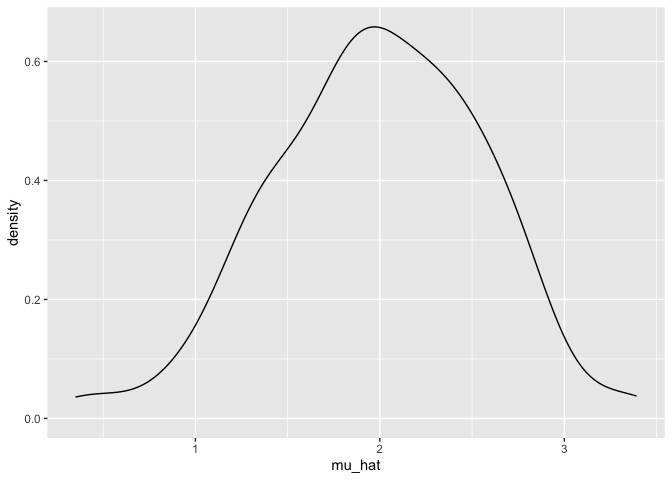
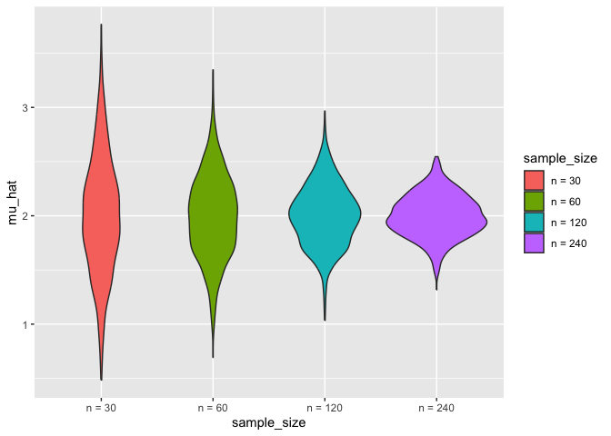
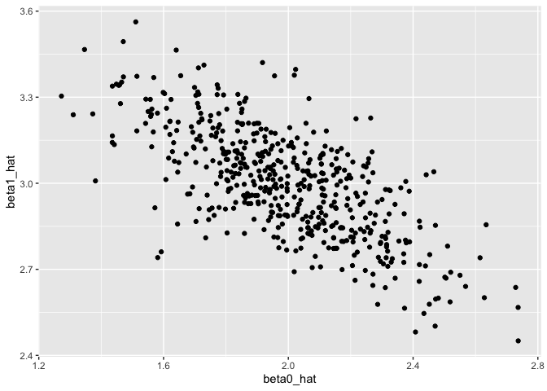
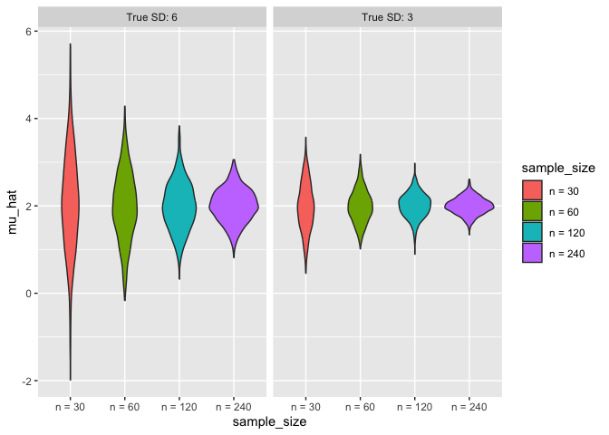

simulation
================
Hanrui Li
2024-10-31

``` r
library(tidyverse)
```

    ## ── Attaching core tidyverse packages ──────────────────────── tidyverse 2.0.0 ──
    ## ✔ dplyr     1.1.4     ✔ readr     2.1.5
    ## ✔ forcats   1.0.0     ✔ stringr   1.5.1
    ## ✔ ggplot2   3.5.1     ✔ tibble    3.2.1
    ## ✔ lubridate 1.9.3     ✔ tidyr     1.3.1
    ## ✔ purrr     1.0.2     
    ## ── Conflicts ────────────────────────────────────────── tidyverse_conflicts() ──
    ## ✖ dplyr::filter() masks stats::filter()
    ## ✖ dplyr::lag()    masks stats::lag()
    ## ℹ Use the conflicted package (<http://conflicted.r-lib.org/>) to force all conflicts to become errors

``` r
set.seed(1)
```

## Simulation: Mean and SD for one **n**

$$x_i \sim N[\mu, \sigma]$$

for subjects $1 \le i \le n$ and return estimates $\hat{\mu}$,
$\hat{\sigma}$

``` r
sim_mean_sd = function(n, mu = 2, sigma = 3){
  
  sim_data = tibble(
    x = rnorm(n, mean = mu, sd = sigma)
  )
  
  sim_data |>
    summarize(
      mu_hat = mean(x),
      sigma_hat = sd(x)
    )
}
```

$$\hat{\mu} \sim [\mu, \frac{\sigma}{\sqrt{n}}]$$

The estimates follow a Normal distribution.

Run `sim_mean_sd` 100 times to see the effect of randomness in $x_i$ on
estimates $\hat{\mu}$, $\hat{\sigma}$

``` r
output = vector("list", 100)

for (i in 1:100){
  output[[i]] = sim_mean_sd(30)
}

sim_results = bind_rows(output)
sim_results
```

    ## # A tibble: 100 × 2
    ##    mu_hat sigma_hat
    ##     <dbl>     <dbl>
    ##  1   2.25      2.77
    ##  2   2.40      2.39
    ##  3   2.33      2.88
    ##  4   2.34      2.65
    ##  5   1.01      2.77
    ##  6   2.71      3.17
    ##  7   2.20      3.25
    ##  8   1.29      3.04
    ##  9   2.07      2.79
    ## 10   2.41      3.09
    ## # ℹ 90 more rows

Map `sim_mean_sd` over the `sample_size` column to replicate the
simulation in the previous loop

``` r
sim_results_df = 
  expand_grid(
    sample_size = 30,
    iter = 1:100
  ) |>
  mutate(
    estimate_df = map(sample_size, sim_mean_sd)
  ) |>
  unnest(estimate_df)
```

``` r
sim_results_df |>
  ggplot(aes(x = mu_hat)) +
  geom_density()
```

<!-- -->

``` r
sim_results_df |>
  pivot_longer(
    mu_hat:sigma_hat,
    names_to = "parameter",
    values_to = "estimate"
  ) |>
  group_by(parameter) |>
  summarize(
    emp_mean = mean(estimate),
    emp_df = sd(estimate)
  ) |>
  knitr::kable(digits = 3)
```

| parameter | emp_mean | emp_df |
|:----------|---------:|-------:|
| mu_hat    |    1.985 |  0.567 |
| sigma_hat |    2.979 |  0.384 |

``` r
sum_results_df = 
  map(1:100, \(i) sim_mean_sd(30, 2, 3)) |>
  bind_rows()
```

## Simulation: Mean for several **n**s

``` r
sim_results_df = 
  expand_grid(
    sample_size = c(30, 60, 120, 240),
    iter = 1:1000
  ) |> 
  mutate(
    estimate_df = map(sample_size, sim_mean_sd)
  ) |> 
  unnest(estimate_df)
```

Distribution of mean estimates across sample sizes

``` r
sim_results_df |> 
  mutate(
    sample_size = str_c("n = ", sample_size),
    sample_size = fct_inorder(sample_size)) |> 
  ggplot(aes(x = sample_size, y = mu_hat, fill = sample_size)) + 
  geom_violin()
```

<!-- -->

look at the empirical mean and variance of these estimates

``` r
sim_results_df |> 
  pivot_longer(
    mu_hat:sigma_hat,
    names_to = "parameter", 
    values_to = "estimate") |> 
  group_by(parameter, sample_size) |> 
  summarize(
    emp_mean = mean(estimate),
    emp_var = var(estimate)) |> 
  knitr::kable(digits = 3)
```

    ## `summarise()` has grouped output by 'parameter'. You can override using the
    ## `.groups` argument.

| parameter | sample_size | emp_mean | emp_var |
|:----------|------------:|---------:|--------:|
| mu_hat    |          30 |    2.001 |   0.289 |
| mu_hat    |          60 |    1.992 |   0.147 |
| mu_hat    |         120 |    2.005 |   0.079 |
| mu_hat    |         240 |    1.999 |   0.038 |
| sigma_hat |          30 |    2.974 |   0.154 |
| sigma_hat |          60 |    2.999 |   0.068 |
| sigma_hat |         120 |    2.996 |   0.039 |
| sigma_hat |         240 |    2.994 |   0.018 |

## Simulation: SLR for one **n**

$$y_i = \beta_0+\beta_1 x_i + \epsilon_i$$

for subjects $1 \le i \le n$ with $\epsilon_i \sim N[0,1]$ and returns
estimates $\hat{\beta}_0$ and $\hat{\beta}_1$

``` r
sim_regression = function(n, beta0 = 2, beta1 = 3) {
  
  sim_data = 
    tibble(
      x = rnorm(n, mean = 1, sd = 1),
      y = beta0 + beta1 * x + rnorm(n, 0, 1)
    )
  
  ls_fit = lm(y ~ x, data = sim_data)
  
  tibble(
    beta0_hat = coef(ls_fit)[1],
    beta1_hat = coef(ls_fit)[2]
  )
}
```

$$\hat{\beta}_0 \sim [\beta_0,\sigma^2(\frac{1}{n} + \frac{\bar{x}}{\sum(x_i-\bar{x})^2})]$$
and

$$\hat{\beta}_1\sim[\beta_1,\frac{\sigma^2}{\sum(x_i-\bar{x})^2}]$$

``` r
sim_results_df = 
  expand_grid(
    sample_size = 30,
    iter = 1:500
  ) |> 
  mutate(
    estimate_df = map(sample_size, sim_regression)
  ) |> 
  unnest(estimate_df)
```

``` r
sim_results_df |> 
  ggplot(aes(x = beta0_hat, y = beta1_hat)) + 
  geom_point()
```

<!-- -->

## Varying two simulation parameters

``` r
sim_results_df = 
  expand_grid(
    sample_size = c(30, 60, 120, 240),
    true_sd = c(6, 3),
    iter = 1:1000
  ) |> 
  mutate(
    estimate_df = 
      map2(sample_size, true_sd, \(n, sd) sim_mean_sd(n = n, sigma = sd))
  ) |> 
  unnest(estimate_df)
```

``` r
sim_results_df |> 
  mutate(
    true_sd = str_c("True SD: ", true_sd),
    true_sd = fct_inorder(true_sd),
    sample_size = str_c("n = ", sample_size),
    sample_size = fct_inorder(sample_size)) |> 
  ggplot(aes(x = sample_size, y = mu_hat, fill = sample_size)) + 
  geom_violin() + 
  facet_grid(. ~ true_sd)
```

<!-- -->
